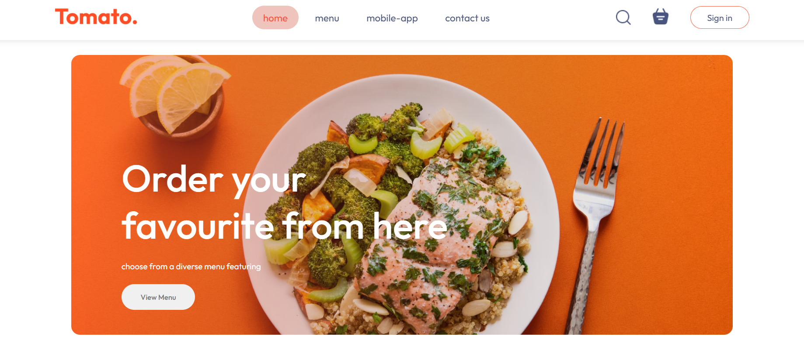
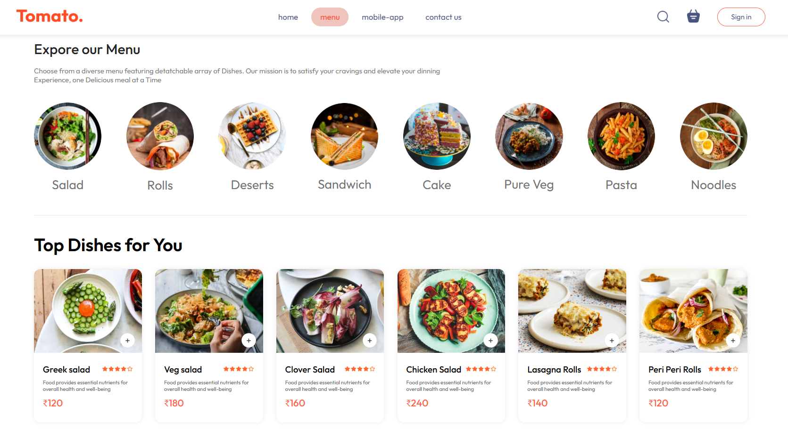
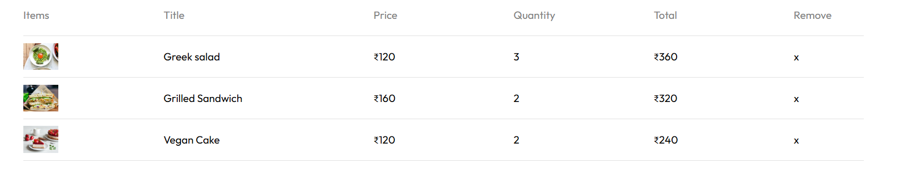
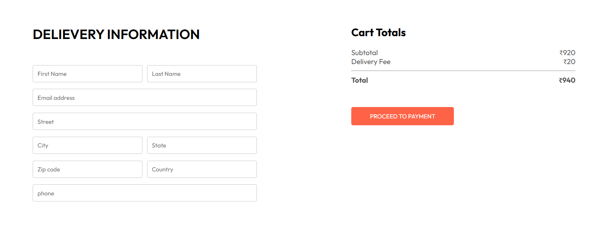

# 🍅 Tomato - Food Delivery App

<div align="center">
  <h3>A modern and responsive food delivery web application built with React</h3>
  
  [](https://food-delivery-tomato-ql6k.onrender.com/)
  [](https://reactjs.org/)
  [](https://vitejs.dev/)
  
  <p>Browse menus • Add to cart • Place orders • Enjoy delicious food! 🚀</p>
</div>

---

## 📸 Showcase

<table>
  <tr>
    <td align="center"><strong>🏠 Homepage</strong></td>
    <td align="center"><strong>🍽️ Menu & Food Display</strong></td>
  </tr>
  <tr>
    <td></td>
    <td></td>
  </tr>
  <tr>
    <td align="center"><strong>🛒 Shopping Cart</strong></td>
    <td align="center"><strong>💳 Checkout Page</strong></td>
  </tr>
  <tr>
    <td></td>
    <td></td>
  </tr>
</table>

---

## ✨ Features

- 🍽️ **Browse Menu**: Interactive and categorized menu to explore different food items
- 🛒 **Shopping Cart**: Fully functional cart to add, remove, and view selected items
- ⚡ **Dynamic UI**: Cart and total amount update instantly as items are added or removed
- 🎨 **Animated Navigation**: Sleek, animated navigation bar for a modern user experience
- 📊 **Order Summary Chart**: Dynamic pie chart on the cart page to visualize cost breakdown
- 📱 **Responsive Design**: Fully responsive layout that works on desktop, tablet, and mobile
- 🏪 **Customer Showcase**: Stylish section to display trusted restaurant partners

---

## 🛠️ Technologies Used

<div align="center">

| Category | Technology |
|----------|------------|
| **Frontend** |   |
| **State Management** |  |
| **Routing** |  |
| **Animations** |  |
| **Charts** |  |
| **Styling** |  |
| **Deployment** |  |

</div>

---

## 🚀 Getting Started

### Prerequisites

Make sure you have the following installed:
-  **Node.js** (which includes npm)

### Installation

1. **Clone the repository**
   ```bash
   git clone https://github.com/ADITYAARYAN-01/Food-Delivery-Tomato.git
   ```

2. **Navigate to the project directory**
   ```bash
   cd Food-Delivery-Tomato
   ```

3. **Install dependencies**
   ```bash
   npm install
   ```

4. **Start the development server**
   ```bash
   npm run dev
   ```

5. **Open your browser**
   
   The application will be available at `http://localhost:5173` 🎉

---

## 📁 Project Structure

```
📦 src/
├── 📁 assets/          # Static assets (images, data)
├── 📁 components/      # Reusable React components
│   ├── Navbar/
│   ├── Footer/
│   └── ...
├── 📁 context/         # Global state management
│   └── StoreContext.js
├── 📁 pages/           # Main application pages
│   ├── Home/
│   ├── Cart/
│   └── PlaceOrder/
├── 📄 App.jsx          # Main app component with routing
└── 📄 main.jsx         # Application entry point
```

---

## 🌐 Deployment

This application is deployed as a **Static Site** on [Render](https://render.com/), with automatic deployments from the `main` branch.

### Deployment Configuration:
- **Build Command**: `npm install && npm run build`
- **Publish Directory**: `dist`
- **Rewrite Rule**: `/* -> /index.html` (for client-side routing support)

> 🔄 **Auto-Deploy**: Any push to the main branch triggers automatic deployment!

---

<div align="center">
  
  ### 🎉 Enjoy your food delivery experience with Tomato!
  
  [](https://food-delivery-tomato-ql6k.onrender.com/)
  
  ---
  
  **Made with ❤️ by [ADITYAARYAN-01](https://github.com/ADITYAARYAN-01)**
  
</div>